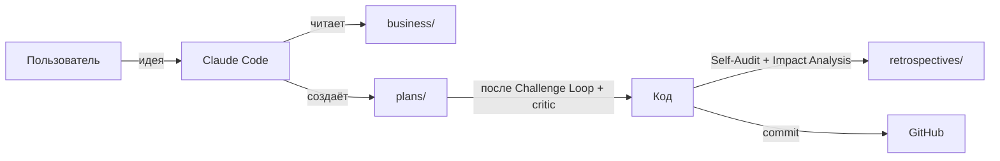

# smyslokod-starter

Стартовый шаблон для **смысло-кодинга** — методологии, при которой смысл проекта живёт в репозитории отдельно от кода. Бизнес-контекст, цели, правила и готовые промпты лежат в markdown-файлах, которые читает Claude Code (и любой другой AI-агент), прежде чем что-либо менять.

**Стек-агностично.** Шаблон не привязан к Next.js / Python / боту / mobile. Вы выбираете стек на старте, и Claude помогает его поставить — а методология уже на месте.

---

## Что внутри

| Папка / файл | Зачем |
| --- | --- |
| `business/` | «Мозг» проекта: компания, продукты, аудитория, цели, экономика, маркетинг, активы. Карта в `business/INDEX.md` |
| `plans/` | Один план = одна функция. Шаблон с блоками «10 причин провала», Challenge Loop, Self-Audit, Impact Analysis |
| `retrospectives/` | Итог каждой сессии — память для будущих |
| `.claude/rules/` | Правила: безопасность, git, планирование, принципы кодинга, UI, бизнес-контекст, деплой |
| `.claude/agents/` | 5 субагентов: researcher, architect, critic, qa-tester, ux-designer |
| `.claude/skills/` | 4 скилла: project-bootstrap (3 режима), diagnose, tdd, grill-me |
| `.claude/settings.json` | Permissions: deny на чтение `.env`, опасные `rm -rf` / force-push, ask на коммиты и push |
| `.githooks/` | pre-push (защита main от force-push) и pre-commit (блок коммита `.env` и API-токенов) |
| `docs/prompts/` | 14 готовых промптов под типовые сценарии. Карта в `docs/prompts/INDEX.md` |
| `docs/deployment/` | Инструкции по Vercel / Railway / Amvera (ФЗ-152) |
| `scripts/` | doctor (диагностика окружения) + install-hooks |
| `START_HERE.md` | Главный промпт для первого запуска шаблона |
| `CLAUDE.md` / `AGENTS.md` | Карта проекта для Claude Code и других агентов |
| `LICENSE` | MIT |

---

## Кому подходит

- Основатель / соло-разработчик, которому нужно, чтобы AI-агент действовал в рамках бизнес-контекста.
- Команда, которая хочет фиксировать бизнес-знания в Git, а не в Notion.
- Тот, кто пробовал Cursor / Claude Code и устал объяснять одно и то же в каждой сессии.

**Это НЕ:**

- Готовая SaaS-платформа.
- Аналог `create-next-app` — здесь нет привязки к стеку. Только методология и обвязка.

---

## Быстрый старт

```bash
# 1. Клонировать
git clone https://github.com/Avalon-27reg/smyslokod-starter.git my-project
cd my-project

# 2. Включить git-хуки (защита main + блок секретов)
bash scripts/install-hooks.sh        # macOS / Linux / Git Bash / WSL
pwsh scripts/install-hooks.ps1       # Windows PowerShell

# 3. Открыть в VS Code
code .

# 4. В Claude Code вставить промпт из START_HERE.md
```

Дальше Claude задаст 3 коротких вопроса (срок, монетизация, факты про аудиторию) и предложит **режим адаптации**:

- **MINIMAL** (15–30 мин) — лендинг, прототип, гипотеза.
- **LITE** (45–60 мин) — MVP, стартап на коленке.
- **FULL** (90–120 мин) — коммерческий продукт с ПДн / платежами / командой.

Можно переопределить вручную или зайти через shortcut-промпты `docs/prompts/bootstrap-{minimal,lite,full}.md`.

---

## Что в шаблоне НЕТ кода

Раньше шаблон шёл с заготовкой Next.js. Это ограничивало аудиторию: для Telegram-бота на Python, мобильного приложения, контент-проекта или Python-бэкенда заготовка была лишней.

Теперь стек выбирается на старте — Claude поставит то, что нужно вашему проекту, по запросу. Все правила (UI / деплой / git / безопасность) написаны стек-агностично и применяются к любому стеку, который вы выберете.

---

## Workflow



Цикл одной сессии:

1. `docs/prompts/start-session.md` — войти в контекст, понять что осталось.
2. Конкретный сценарий: `debug-bug` / `add-tdd-feature` / `grill-idea` / `create-feature-plan`.
3. `docs/prompts/end-session.md` — обновить план, ретроспектива, бизнес-файлы.

---

## Готовые промпты (14 штук)

См. `docs/prompts/INDEX.md`. Группы:

- **Старт нового проекта:** bootstrap-project (auto-detect), bootstrap-minimal, bootstrap-lite, bootstrap-full, create-business-brain.
- **Каждый день:** start-session, end-session.
- **По типу задачи:** grill-idea, create-feature-plan, run-critique, add-tdd-feature, debug-bug, visual-review, deploy-project.

---

## Безопасность

- Запрет на чтение `.env*` в `.claude/settings.json` (Claude Code не прочитает их даже если попросить).
- Pre-commit хук блокирует коммит `.env`, `*.pem`, `*.key` и строк, похожих на API-ключи (OpenAI / Anthropic / AWS / GitHub / Google / Slack / JWT).
- Pre-push хук блокирует force-push и удаление веток `main` / `master`.
- Правило в CLAUDE.md: никогда не запускать `git push`, `git push --force`, `git reset --hard`, `git rebase`, `rm -rf` без явного «да» от пользователя.

---

## Деплой

| Куда | Когда выбирать | Инструкция |
| --- | --- | --- |
| **Vercel** | веб-проект без RU-ПДн | `docs/deployment/vercel.md` |
| **Railway** | международный с бэком и БД | `docs/deployment/railway.md` |
| **Amvera** | российские пользователи + ФЗ-152 | `docs/deployment/amvera.md` |

Все секреты — только через Environment Variables хостинга, не в репо.

---

## Лицензия

MIT — см. [LICENSE](./LICENSE). Используйте для коммерческих и некоммерческих проектов.

---

## Что дальше

1. Прочитайте [CLAUDE.md](./CLAUDE.md) — карта для агента и для вас.
2. Изучите [business/INDEX.md](./business/INDEX.md) — мозг проекта.
3. Запустите [START_HERE.md](./START_HERE.md) — Claude сам адаптирует шаблон.
