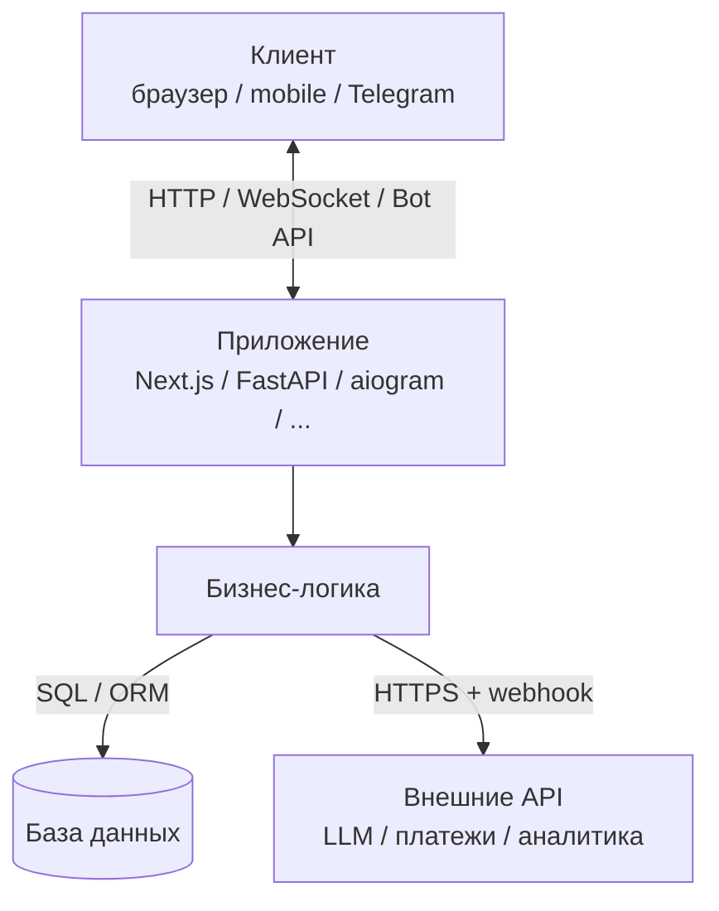

# Архитектура — обзор

Шаблон **стек-агностичный** — конкретная архитектура (язык, фреймворк, БД, авторизация) выбирается на старте через скилл `project-bootstrap` или вручную пользователем. Этот файл становится живым после адаптации: вписываете выбранный стек, структуру папок и принципы вашего проекта.

## Что заполнить после выбора стека

После того как стек выбран, перепишите эти разделы:

### 1. Стек

| Слой | Что выбрано | Почему |
| ---- | ----------- | ------ |
| Язык | _<TypeScript / Python / Go / Rust / ...>_ | _<обоснование>_ |
| Фреймворк | _<Next.js / FastAPI / Django / Express / Vite + React / ...>_ | _<обоснование>_ |
| Стили (если UI) | _<Tailwind / CSS Modules / styled-components / нативный CSS / ...>_ | _<обоснование>_ |
| UI-компоненты | _<shadcn/ui / PrimeVue / нативные / ...>_ | _<обоснование>_ |
| Менеджер пакетов | _<pnpm / npm / pip / poetry / cargo / ...>_ | _<обоснование>_ |
| Линт | _<ESLint / Ruff / Clippy / ...>_ | _<обоснование>_ |
| Формат | _<Prettier / Black / rustfmt / ...>_ | _<обоснование>_ |
| База данных | _<Postgres / SQLite / MongoDB / нет>_ | _<обоснование>_ |
| Деплой | _<Vercel / Railway / Amvera / VPS / ...>_ | см. `docs/deployment/` |

### 2. Структура папок

После выбора стека опишите вашу структуру здесь. Примеры популярных стеков:

**Next.js + Tailwind + shadcn/ui:**
```
src/
├── app/             # App Router
│   ├── layout.tsx
│   ├── page.tsx
│   └── globals.css
├── components/ui/   # shadcn компоненты
└── lib/utils.ts
```

**Python (FastAPI):**
```
app/
├── main.py          # точка входа
├── api/             # роуты
├── models/          # ORM-модели
├── services/        # бизнес-логика
└── tests/
```

**Telegram-бот (aiogram):**
```
bot/
├── main.py
├── handlers/
├── states/
├── keyboards/
└── services/
```

### 3. Принципы (стек-агностичные)

Эти принципы применимы к любому стеку:

- **Сегрегация данных и UI.** Запросы к БД / внешним API — в одном месте. UI только отображает.
- **Чистая логика отдельно от I/O.** То, что можно покрыть TDD (см. скилл `tdd`) — должно быть выделено в чистые функции / классы без I/O.
- **Конфигурация — через env, не через код.** Все секреты, URL, флаги — через переменные окружения.
- **Один входной слой.** API / контроллеры — тонкие, бизнес-логика — глубже.
- **Логирование без секретов.** В лог не попадают токены, пароли, ПДн.

### 4. Переменные окружения

В каждом фреймворке своя конвенция «публичных» переменных:

- **Next.js:** префикс `NEXT_PUBLIC_` — попадает в браузер. Без префикса — серверная.
- **Vite:** префикс `VITE_` — попадает в браузер.
- **Create React App:** префикс `REACT_APP_`.
- **Python/FastAPI / Go / Rust:** все переменные серверные, в браузер ничего не попадает по умолчанию.

**Правило:** всё, что без публичного префикса (или для серверного языка любое) — секрет. Никогда не светить в клиентском коде.

### 5. Точки расширения

Типичные шаги после первой работающей версии:

1. **Аутентификация** — выбор зависит от стека (NextAuth, Clerk, FastAPI-Users, Devise, и т.д.).
2. **БД** — Postgres + ORM выбранного стека (Prisma, Drizzle, SQLAlchemy, Diesel, ...).
3. **Очередь / фоновые задачи** — BullMQ, Celery, qstash, RabbitMQ.
4. **Аналитика** — Yandex.Metrika, Plausible, Posthog.
5. **Платежи** — Yookassa (RU) / Stripe (международные).

Каждое добавление — через субагент `architect` и через ADR в `docs/decisions/`.

## Mermaid: типовая верхнеуровневая схема


