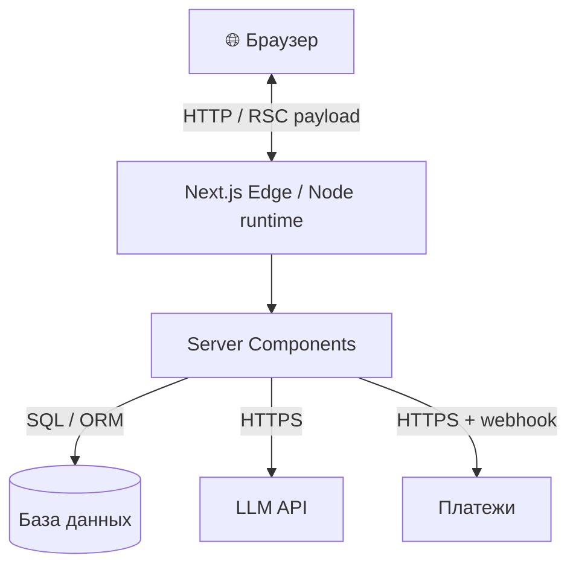

# Архитектура — обзор

Этот документ описывает архитектуру шаблона на старте. После адаптации под конкретный проект — обновите соответствующие разделы.

## Стек

| Слой | Что выбрано | Почему |
| ---- | ----------- | ------ |
| Фреймворк | Next.js 15 (App Router) | RSC, edge-готов, Vercel-friendly, всё из коробки |
| Язык | TypeScript 5 strict | предотвращает 80% типовых багов |
| Стили | Tailwind CSS 3 | utility-first, без CSS-файлов |
| UI-компоненты | shadcn/ui (Radix + Tailwind) | копируются в проект, мы владеем кодом |
| Иконки | lucide-react | свежий, ESM-friendly, типизирован |
| Менеджер пакетов | pnpm 10 | быстрый, экономный к диску, надёжный с workspace |
| Линт | ESLint 9 flat-config + `eslint-config-next` | официальный из коробки |
| Формат | Prettier + `prettier-plugin-tailwindcss` | сортировка классов |

## Структура папок

```
src/
├── app/             # роуты Next.js (App Router)
│   ├── layout.tsx   # корневой layout (html / body / metadata)
│   ├── page.tsx     # главная
│   └── globals.css  # Tailwind + CSS-переменные shadcn
├── components/      # переиспользуемые компоненты
│   └── ui/          # компоненты shadcn (после `pnpm dlx shadcn@latest add`)
└── lib/
    └── utils.ts     # cn() для shadcn
```

## Принципы

### Серверное по умолчанию

В App Router компоненты по умолчанию серверные. Делайте Client Component (`"use client"`) **только если** нужно: state, effects, обработчики, refs, browser API.

### Сегрегация данных и UI

- Запросы к БД / внешним API — в Server Components или Server Actions.
- UI только отображает.
- `lib/` — утилиты без зависимости от React.

### Пути

`@/*` → `src/*`. Используйте абсолютные импорты везде.

```tsx
import { cn } from "@/lib/utils";
import { Button } from "@/components/ui/button";
```

### Переменные окружения

- `NEXT_PUBLIC_*` — попадают в браузер. **Только то, что не секрет.**
- Без префикса — серверные. Доступны только в Server Components / API routes / Server Actions.

### Изображения

- `<Image>` из `next/image`, не ``.
- Внешние домены добавляйте в `next.config.ts` `images.remotePatterns`.

## Точки расширения

Обычно следующие шаги после адаптации:

1. Добавить аутентификацию (`next-auth` / `clerk` / собственная).
2. Добавить БД (`prisma` + Postgres / `drizzle` + Postgres).
3. Добавить очередь / фоновые задачи (`upstash/qstash`, `bullmq`).
4. Добавить аналитику (Yandex.Metrika через `next/script`, Plausible, Posthog).
5. Добавить платежи (yookassa / stripe).

Каждое добавление — через **архитектора** (`.claude/agents/architect.md`) и через ADR в `docs/decisions/`.

## Mermaid: верхний уровень


