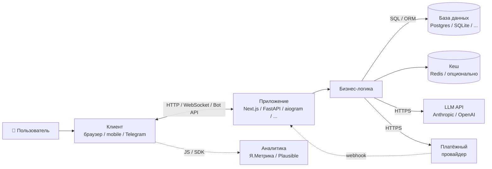
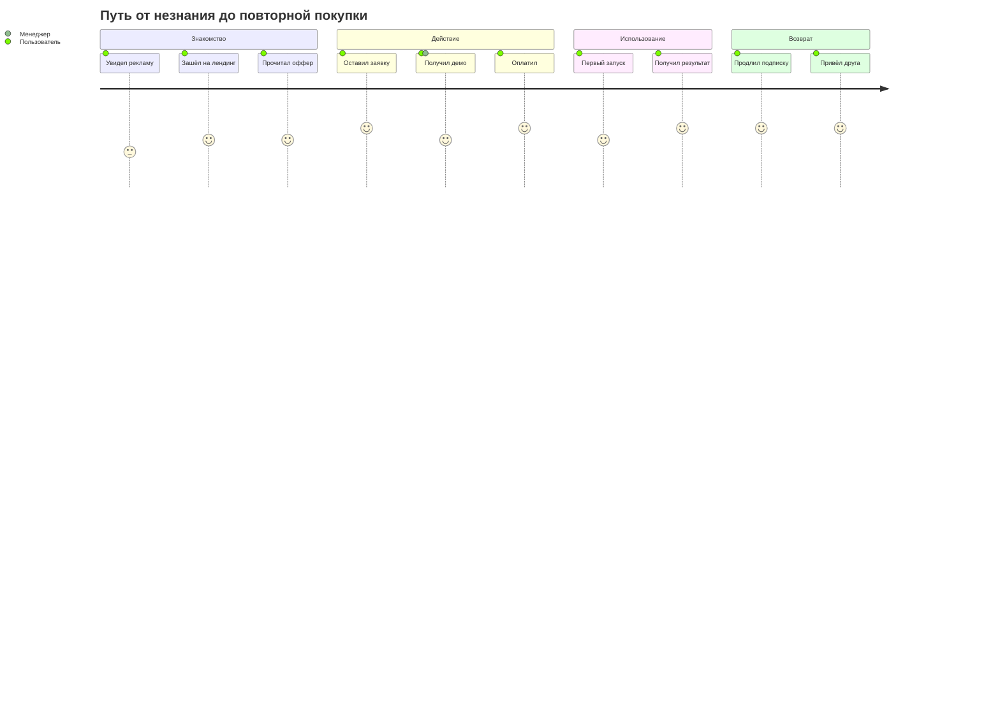
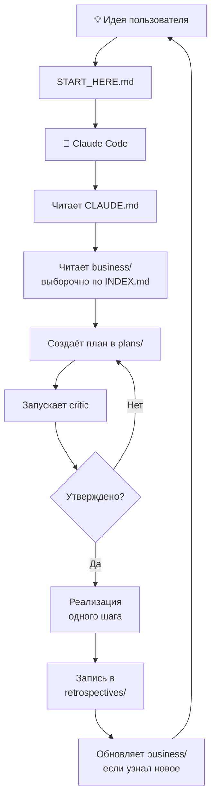

# Визуальная карта проекта

Три диаграммы для быстрого ориентирования. Если меняется архитектура — обновляйте здесь и в `docs/architecture/overview.md`.

## 1. Архитектура проекта

> Шаблонная схема — обновите после выбора стека под свою архитектуру (фреймворк, БД, внешние интеграции).

## 2. Путь пользователя

Замените на реальный путь после адаптации. Шаблонный пример:

## 3. Workflow Claude Code

